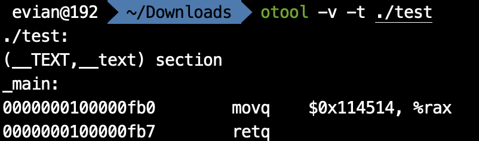
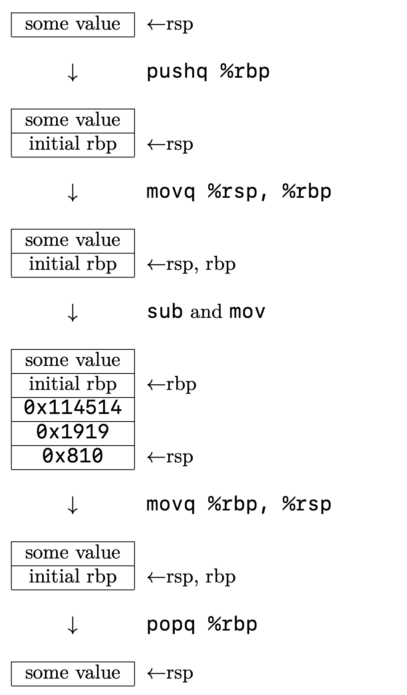

在上一篇文章中，我们分析了第一个汇编程序。

```assembly
# exit.s    
    .section    __TEXT,__text
    .globl  _main
_main:
    movq    $0, %rax
    retq
```

这个汇编程序是我们所有汇编程序的框架，因为它实现了程序进入和程序退出的功能。我们接下来所有的程序都是在这个程序的基础上进行修改。

在这篇文章中，我主要介绍的是汇编语言中变量的使用。在x86-64架构下，寄存器的数量很少。而且，寄存器的作用往往是用于运算而不是用于存储。那么，我们在程序中该如何使用变量呢？

# `.equ`定义字面量

最简单的定义变量的方式，是利用汇编器指令`.equ`. 这类似于C语言中的`#define`. 比如说，我在程序开头写上

```assembly
.equ	maxCount, 0x114514
```

那么，我在之后的程序里就可以写

```assembly
movq	$maxCount, %rax
```


来表示将`0x114514`赋值给rax寄存器。

同时这里应当指出，这个指令是汇编器指令，在汇编的时候，会自动将所有的`maxCount`直接用`0x114514`替代。比如说，我有以下程序：

```assembly
	.text
	.globl	_main
	.equ	maxCount, 0x114514
_main:
	movq	$maxCount, %rax
	retq
```

我们通过汇编、链接以后，得到一个`test`可执行文件。我们可以用之前提到的MachOView软件，或者在终端中键入

```bash
otool -v -t ./test
```

来查看生成的可执行文件中`__TEXT`段`__text`节的内容：



由此可知，最终生成的文件中，是直接替换得到的。

此外，`.equ`还有一个比较方便的地方在于，它可以支持简单的算术运算，如加减乘除等。比如说，我可以写`.equ	maxCount, 1919-810`, 那么接下来所有出现`maxCount`的地方，都会用`1109`来替代。

但是，正如C语言中的`#define`定义的宏一样，`.equ`定义的变量只是一个简单的替换，并不支持对这个变量重新赋值之类的操作。这个变量也没有其地址，只是一个字面量。

# 局部变量

## 栈

我们知道，在C语言中，局部变量在栈上分配。在汇编语言中也是这样。因此，我们来回忆一下「栈」的概念。

在操作系统基础中，我们谈到，在一个程序运行的时候，系统会自动给这个程序分配一个栈区。这个栈区和数据结构中所说的栈类似，也支持压栈和弹栈的操作。栈区在逻辑地址空间里是一块连续的空间，栈底是固定的，每次压栈，都会使栈顶向逻辑地址减小的方向移动。

在几个寄存器中，有一个寄存器和栈的关系非常大，那就是rsp寄存器。从它的名字就可以看出来，stack pointer, 它存储的值永远是栈顶的地址，所以它又被叫做栈顶指针。我们可以用`(%rsp)`来获取栈顶存储的值，通过`a(%rsp)`, 其中`a`是任何一个整数，来获取地址是rsp存储的值加`a`处的内存单元的值。比如说，`2(%rsp)`就是栈顶上方（逻辑地址增大方向）2个字节处的值，`-2(%rsp)`就是栈顶下方（逻辑地址减小方向）2个字节处的值。关于这个记号，我也会在之后的寻址方式中提到。

在汇编语言中，压栈和弹栈的助记符分别是`push`和`pop`. 这两个操作均有一个操作数。`push`的操作是将栈顶指针向下移动（也就是将rsp内的值减小），并将移动后rsp对应位置内存区域的值赋为其操作数，而pop则相反。这里“向下移动”的距离是根据`push`后面跟着的字母决定的，如`pushq`就是把rsp内的值减8.

此外，如果是想获得栈顶的值，而不弹栈，可以直接用`mov`来实现。如`popq	%rax`是将栈顶的8个字节内存储的值赋给rax, 并且栈顶指针向上移动8个字节。而`movq	(%rsp), %rax`则是只将栈顶的8个字节内存储的值赋给rax, 不涉及栈顶指针的移动。而如果只想弹栈却不想赋值，那么直接对rsp进行`add`即可。如想把栈顶的8个字节的数据弹栈，就直接`addq	$8, %rsp`.

同时，对于`push`而言，如果我们一下子准备把许多值压入栈内，那么可以先用`sub`指令减小rsp, 再用`mov`移动。比如说：

```assembly
# method 1
pushq	$0x114514
pushq	$0x1919
pushq	$0x810

# method 2
subq	$24, %rsp
movq	$0x114514, 16(%rsp)
movq	$0x1919, 8(%rsp)
movq	$0x810, (%rsp)
```

方法一和方法二的最终效果是一样的。但是，我们建议使用方法二，也就是“先`sub`, 再`mov`”，因为这样更高效。

## 使用局部变量

讲完了栈的概念，接下来就是如何使用局部变量了。使用局部变量非常简单，就是将局部变量放到栈上，然后使用的时候直接去访问栈上对应的地址空间就行。然后在返回之前，把栈恢复即可。

但是，这里有一个常用的技巧。像上面的例子中写的，我们是通过对rsp中存储的地址加偏移量去访问局部变量，但是，如果我们之后又有了压栈、弹栈的操作，那么，偏移量就会改变。这种不稳定性十分不利于我们编程。因此，我们又用了另一个寄存器rbp来解决这个问题。rbp, 顾名思义，base pointer, 基地址指针，一般是用来使用偏移量寻址的。我们使用的技巧是，先将rbp`push`进栈（之所以保留我会在后面的调用约定里说到），然后利用之前的手法对rsp`sub`. 然后，利用rbp的偏移量来引用局部变量。最后在返回前，将`rbp`赋值给`rsp`, 此时栈顶指针指向的是最初对rbp`push`之后的位置，然后将栈顶`pop`出来给rbp，最后返回。

比如说，我有以下C程序：

```c
int main()
{
  int a = 0x114514;
  int b = 0x1919;
  int c = 0x810;
  return 0;
}
```

那么，它对应的汇编程序如下：

```assembly
_main:
	pushq	%rbp
	movq	%rsp, %rbp
	subq	$24, %rsp
	
	movq	$0x114514, -8(%rbp)
	movq	$0x1919, -16(%rbp)
	movq	$0x810, -24(%rbp)
	
	movq	$0, %rax
	
	movq	%rbp, %rsp
	popq	%rbp
	retq
```

它对应的栈的变化如图所示：



由此可见，在执行完`popq	%rbp`之后，栈又恢复为最初进入时的模样。

我们在使用rbp+偏移量来访问局部变量的时候，有时候会觉得要把变量对应的偏移量记住，这会比较麻烦。我们可以结合上面讲到的`.equ`定义字面量来解决这一问题：

```assembly
_main:
	.equ	a, -8
	.equ	b, -16
	.equ	c, -24
	pushq	%rbp
	movq	%rsp, %rbp
	subq	$24, %rsp
	
	movq	$0x114514, a(%rbp)
	movq	$0x1919, b(%rbp)
	movq	$0x810, c(%rbp)
	
	movq	$0, %rax
	
	movq	%rbp, %rsp
	popq	%rbp
	retq
```

这样，我们只需要之后用`a(%rbp)`就可以指代`a`了。

# 可以在哪看到这系列文章

我在我的[GitHub](https://github.com/Evian-Zhang/Assembly-on-macOS)上，[知乎专栏](https://zhuanlan.zhihu.com/c_1132336120712765440)上和[CSDN](https://blog.csdn.net/EvianZhang)上同步更新。

上一篇文章：[macOS上的汇编入门（六）——汇编语言初识](macOS上的汇编入门（六）——汇编语言初识.md)