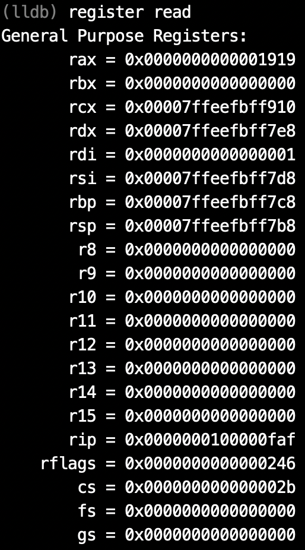
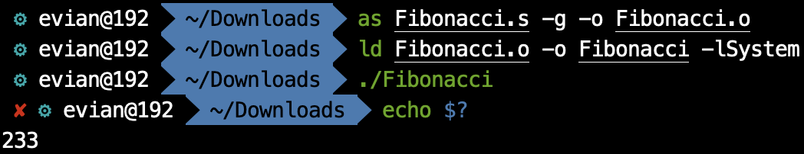

通过之前的几篇文章，我们了解了汇编语言的基本语法和变量的使用、寻址方式等，但我们的程序到目前为止，都只局限在`_main`内，既没有函数调用，也没有控制结构，进了`_main`以后一条路走到`retq`. 在这篇文章中，我主要介绍的是汇编语言中的控制结构——跳转，与函数调用。不过在介绍这两个之前，首先需要介绍的是跳转与函数调用的基础——标签。

# 标签

标签(Label), 是汇编语言中一个重要的组成部分。我们之前在`__DATA`段`__data`节里定义变量的时候，就使用了标签。我们通常使用的标签，定义时是以冒号`:`结尾的一个标识符，且开头不能是数字。`LBB0:`, `a:`, `_func:`, `_main:`都是标签的定义。

我们可以在`.data`段，也可以在`.text`段定义标签，只需要在那里写上标签加上`:`即可。比如说，

```assembly
loop_begin:	movq	$0x114514, %rax
	jmp	loop_begin
```

就定义了一个标签`loop_begin`, 并且在下一条指令中使用了它. 接下来任何一个地方使用到`loop_begin`, 就代表这个指令所处的地址。

一般来说，定义的标签只能在同一个汇编文件中使用，如果一个汇编文件想使用另一个汇编文件定义的标签，需要另一个汇编文件用`.globl`声明标签是全局可见的，比如说`.globl	_main`.

# 跳转

在介绍完标签之后，就可以解释跳转了。跳转分为无条件跳转与条件跳转。我们首先介绍无条件跳转。

## 无条件跳转

无条件跳转对应的助记符是`jmp`. 其操作数是标签。`jmp	loop_begin`就是跳转到`loop_begin`标记的位置。这里就有一个问题，这样的跳转，是不是position indenpendent的呢？答案是是的。但是和之前PC-relative的技巧不同，这里PIC的方法不是程序员做的，而是汇编器做的。汇编器会直接将`jmp`翻译成相对跳转的机器码，对程序员来说是透明的。所以，我们并不需要太过关心这里的PIC.

我们使用无条件跳转的时候要特别注意，因为极易造成死循环。比如说我们上面的那两行代码，就是死循环。

## 条件跳转

相比于无条件跳转，我们更常用的是条件跳转。无条件跳转相当于C语言中的`goto`, 而条件跳转则是我们更常见的`if`, `while`等控制语句。下面的例子给我们演示了条件跳转：

```assembly
	cmp	$0x114514, %rax
	je	loop_begin
```

`cmp`, 就是compare, 比较的意思。`je`中的`e`, 就是`equate`, 相等。我们可以大致理解一下这个的意思：如果`%rax`内的值与`0x114514`相等，那么就跳转到`loop_begin`这个标签处。那么，这是如何做到的呢？

我们利用`lldb`查看在执行`cmp	$0x114514, %rax`之前和之后，寄存器的变化（关于`lldb`的使用我会在之后的文章中提到）。

在执行`cmp	$0x114514, %rax`之前，寄存器的值为：



在执行`cmp	$0x114514, %rax`之后，寄存器的值为：


对比两张图，我们发现，除了存有当前指令地址的rip寄存器内的值发生了变化以外，还有一个寄存器的值发生了变化，那就是rflags. 这是什么寄存器呢？这又是根据什么变化的呢？

这就是先行者们一个很妙的设计了。事实上，无论是`cmp`还是别的什么指令，其实大多数都有一个副作用——影响rflags寄存器。rflags寄存器，全称是状态标志寄存器。我们看它不能用十六进制看，要用二进制看。

在执行`cmp`之前，rflags的值是`0x246`, 它的二进制表示是`1001000110`. 执行之后，rflags的值是`0x287`, 它的二进制表示是`1010000111`.

这意味着什么呢？事实上，rflags中某些位是由特定的作用的。我们主要关注其低16位：


每一个以F结尾的都代表一个flag, 比如说CF就是carry flag, 是否进位。而我们的`cmp`指令，若两数相等，则会把ZF位置`1`，否则置`0`. 而`je`指令，则是当ZF位为`1`时再跳转，否则什么事也不做。

那么一个指令究竟会影响多少位呢，这个在指令集([64-ia-32-architectures-software-developer-instruction-set-reference-manual](https://www.intel.com/content/dam/www/public/us/en/documents/manuals/64-ia-32-architectures-software-developer-instruction-set-reference-manual-325383.pdf))中会有详细说明，这里不再赘述。只强调一点，在做运算时，往往都会涉及标志位的改变。结果是否为零、是否进位、是否溢出等等，都是决定各个标志位的因素。

而依据不同的标志位，有不同的条件跳转指令。比如说，依据ZF, 有`je`（ZF=`1`时跳转），`jne`（ZF=`0`时跳转）；依据CF, 有`jc`（CF=`1`时跳转），`jnc`（CF=`0`时跳转）。此外，还有依据多个标志位的跳转指令。但是，我们实际上并不太需要记得跳转指令对应的标志位情况，我们需要记住的是跳转指令对应的逻辑情况，比如说，`je`代表相等时跳转，`jne`代表不相等时跳转；`jg`代表大于时跳转，`jge`代表大于等于时跳转；`jl`代表小于时跳转，`jle`代表小于等于时跳转。这里还要强调一下，“大于”、“小于”究竟是谁大谁小。在我们`cmp	a, b`时，实际上执行的是`b`-`a`, 比较的是`b`和`a`. `b`>`a`，会是`jg`的跳转，而`b`<`a`会是`jl`的跳转。

此外，我们还需要记得大部分非跳转指令对应的标志位的改变。比如说，`add`指令涉及的标志位就有OF, SF, ZF, AF, CF和PF.

# 函数

大略地讲完了跳转之后，就涉及到了函数。我们知道，在跳转时，有一个特点，那就是跳转了就回不来了。除非我们在跳转指令之后再加上一个标签，然后在跳转去的部分中找到合适的位置跳转回来。这是比较麻烦的。所以，跳转指令一般指适用在控制语句中，并不会用于函数的调用。当我们进行函数调用时，应该使用全新的指令——`call`和`ret`.

`call`指令和`jmp`指令一样，接受一个标签作为操作数，直观上看和`jmp`的效果也类似，直接跳转到该标签所在的指令。但是，`call`指令还干了一件事——把当前的rip寄存器`push`到栈区里。这实际上和我们利用`jmp`解决跳出去回不来的问题的方法类似，把返回的地址放到栈上。然后，`call`就没事儿了。

在我们执行完函数的运算之后，想要返回之前调用函数的地方，这该怎么办呢？就用到了`ret`. `ret`无操作数，默认当前栈顶，也就是rsp指向的位置，存储的是当初`call`时`push`到栈区的地址，然后直接跳转，并且把那个地址弹栈。因此，在之前提到局部变量的时候，我们在最后恢复了rsp, 让其还是指向最初的位置，目的就是这个。

`call`和`ret`都可以加上一个`q`，形成`callq`和`retq`. 这和`call`和`ret`实际上是没有区别的，只是强调那个地址是8个字节的地址。

# 总结

我们来看一个迭代法计算大于3的数对应的Fibonacci数列的简单的程序：

```assembly
# Fibonacci.s
    .text
    .globl  _main
_main:
    movq    $13, %rdi
    callq   _Fibonacci
    retq

_Fibonacci:
    movq    $1, %rax
    movq    $1, %rbx
compare:
    cmp $2, %rdi
    jg loop_continue
    retq
loop_continue:
    movq    %rax, %rcx
    addq    %rbx, %rax
    movq    %rcx, %rbx
    decq %rdi
    jmp compare
```

这个简单的程序计算了第13项斐波那契数列，并且也用到了这篇文章中所讲的跳转与函数。大家可以仔细研究这个程序。

我们在命令行中键入

```bash
as Fibonacci.s -o Fibonacci.o
```

进行汇编，再键入

```bash
ld Fibonacci.o -o Fibonacci -lSystem
```

进行链接。并使用

```bash
./Fibonacci
```

来执行函数，最后用

```bash
echo $?
```

来查看结果。最终结果如下：



结果正确。

至于这个程序中为什么采用rdi进行参数传递，以及rax作为返回值，还有一些不足和缺陷，我会在下篇文章中提到。

# 可以在哪看到这系列文章

我在我的[GitHub](https://github.com/Evian-Zhang/Assembly-on-macOS)上，[知乎专栏](https://zhuanlan.zhihu.com/c_1132336120712765440)上和[CSDN](https://blog.csdn.net/EvianZhang)上同步更新。

上一篇文章：[macOS上的汇编入门（八）——寻址方式与全局变量](macOS上的汇编入门（八）——寻址方式与全局变量.md)