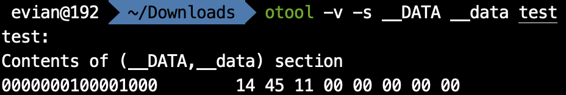
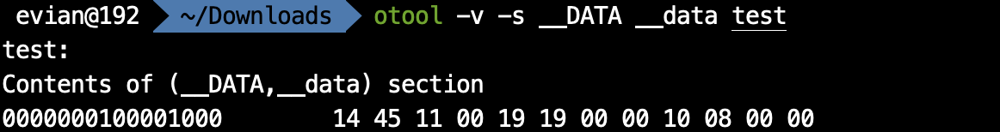
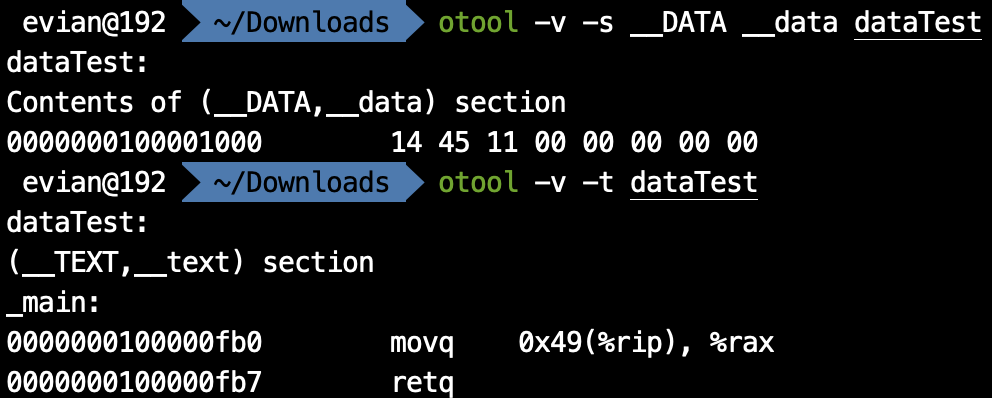

在上一篇文章中，我们讨论了汇编语言中如何定义字面量与局部变量。在这篇文章中，我们将继续讨论，如何在汇编语言中定义C语言中的全局变量。在讨论全局变量之前，我们首先需要介绍一下寻址方式。

# 寻址方式

所谓寻址方式，就是已知地址如何获得该地址对应的内存单元内的值。在上一篇文章中，我们实质已经用到了寻址方式。比如说，已知栈顶的地址存储在rsp内，那么我们是通过`(%rsp)`获得对应位置的内存单元的值的。一般来说，我们寻址方式需要记得下图：


这个记号代表地址为`基址+指标*倍数+偏移量`处的内存单元中存储的**值**。

其中，以`$`开头的都是数字（但注意我们真正写的时候不需要加上`$`符号），以`%`开头的都是寄存器。也就是说，在偏移量、倍数的位置上，不能写寄存器，在基址、指标的位置上，不能写数字。此外，倍数只能是`1`, `2`, `4`, `8`中的一个。

这四个位置都可以省略，省略的位置将用0代替。比如说，`偏移量(基址)`就相当于`基址+偏移量`, `偏移量(, 指标, 倍数)`就相当于`指标*倍数+偏移量`.

这样设计寻址方式是由其原因的。偏移量和基址存在的原因，就是为了解决像我们之前那样通过rsp或者rbp加上偏移量来访问栈上元素的问题。而指标存在的原因，一是在于，我们不仅可以通过寄存器+数字的方式寻址，也希望通过寄存器+寄存器的方式寻址，也就是`(基址, 指标, 1)`这样的方式实现寄存器+寄存器寻址；此外，当我们在某些循环操作时，可以每次递减或递增指标，然后实现对一块连续内存的访问。而倍数存在的原因，则是由于存数的时候可能是占1个字节，也可能是2个，4个或8个字节。

在了解了寻址方式之后，相信大家就会很容易地理解我们之前通过`-8(%rbp)`这样的方式获得栈上元素了。我们可以通过如

```assembly
movq	-8(%rbp), %rax
```

这样的方式，将内存上的值付给寄存器。但是，值得注意的是，

```assembly
movq	-8(%rbp), -16(%rbp)	# wrong
```

这样的方式在x86-64架构下是不支持的，也就是不能直接将一块内存赋给另一块内存。

通过这种寻址方式，我们可以直接获得复杂地址对应的值。那么，有没有一种方式可以让我们获得这个复杂地址本身呢？答案是有的，使用`lea`.

`lea`是load effective address的简称，其拥有两个操作数。我们可以像这样使用：

```assembly
leaq	-8(%rbp), %rax
```

表示将`-8(%rbp)`的地址赋给rax. 我们知道，在64位处理器下，地址都是64位的。因此，`lea`后面一定是`q`, 而不能是别的东西。

# 全局变量

在讲完了寻址方式之后，就可以解决如何在汇编语言中实现C语言中的全局变量了。

在汇编语言中，除了`__TEXT`段以外，还有`__DATA`段，用于存放数据。我们知道，当mach-o可执行文件被执行的时候，一个段对应整数个页，因此，`__DATA`是在逻辑地址空间中是单独的页，这里存放的数据和字面量不同，拥有自己的地址；和栈上分配的数据不同，可以被所有函数访问。在`__DATA`段中，`__data`节存放所有非`const`的已经被初始化过的变量，`__bss`节存放所有未被初始化的`static`的变量，`__common`节存放所有未被初始化过的外部全局变量。类似于`.text`，我们可以用`.data`来代替`.section	__DATA, __data`, 用`.bss`代替`.section	__DATA, __bss`.

因此，我们如果想在汇编语言中拥有一个全局的数`0x114514`, 把它放在`.data`节里。但是，这样就行了吗？

```assembly
	.data
	0x114514
```

这样是不行的。因为，我们之前在讲`mov`的时候提到过，必须跟着`b`, `w`, `l`或`q`来表示数据所占的字节数。在这里也是一样。我们在`__DATA`段中存储数据，需要告诉汇编器这个数据占多少字节，也就是说多少字节的高位要被清零。因此，我们引入汇编器指令`.byte`, `.short`, `.long`, `.quad`. 它们分别代表1字节，2字节，4字节和8字节。比如说，我如果想告诉汇编器我们要存放的数据`0x114514`占8个字节，那么就可以写

```assembly
	.data
	.quad	0x114514
```

我们汇编、链接之后得到可执行文件`test`. 再通过MachOView，或者通过在终端下键入

```bash
otool -v -s __DATA __data test
```

来查看`test`的`__DATA`段`__data`节的数据如下：



由此可以看到，汇编器把它整个8个字节的高位都清零了。

此外，我们如果想定义多个变量，只需要写一个汇编器指令就够了。比如说，

```assembly
	.data
	.quad	0x114514, 0x1919, 0x810
```

就代表`.quad`后面所有的数，都占有8个字节。其效果为：


我们需要注意的是，这些数是“紧挨”在一起的。比如说，我如果把`.quad`改为`.long`, 也就是这三个数每个都是占4个字节，那么效果就变成了



这样完成以后，又有一个新的问题出现了，我们在代码中怎样能访问到这些数据呢？

这时，就需要标签(label). 关于标签，我会在之后跳转与标签中提到。这里我们只需要了解，标签在定义的时候，后面跟着一个冒号，在使用的时候，不要冒号，同时这个标签就代表它所在的地址。如：

```assembly
	.data
a:	.quad	0x114514, 0x1919, 0x810
```

这里`a:`就定义了一个标签。这里定义标签并不会对`__DATA`段`__data`节产生影响，`otool`查看的结果仍然和之前一样。但是，如果我们在代码中使用到`a`时，就会被替换为`0x114514`这个数据开头的逻辑地址。那么，`0x1919`这个数据的地址就可以用`a+8`来访问，`0x810`就是`a+16`.

那我们直接写一个程序：

```assembly
# dataTest.s	
	.data
a:	.quad	0x114514

	.text
	.globl	_main
_main:
	movq	a, %rax
	retq
```

这样行不行呢？

我们在终端下用`as`进行汇编：

```assembly
as dataTest.s -o dataTest.o
```

结果报错了！


"32-bit absolute addressing is not supported in 64-bit mode". 这是为什么呢？

我们回忆一下之前在操作系统基础中提到的ASLR与PIE. macOS中程序的加载默认是使用ASLR的，也就是说，在程序执行的时候，所有数据的地址都会加上一个随机化的偏移量。可是，`a`是`0x114514`在mach-o可执行文件中的地址，是在汇编链接后就确定的，而ASLR则是在执行时才会使用。因此，我们这样写并不是position independent的。所以，我们要使用一个小技巧——PC-relative寻址。

所谓PC，就是program counter. 在x86-64架构下，是存储在寄存器rip中的值。rip寄存器，全称是instruction pointer, 顾名思义，在程序执行一条汇编指令的时候，rip中的值就是**下一条**汇编指令在内存中，也就是逻辑地址空间中的值。注意到这个值是执行时的，也就是ASLR后的值。考虑到即使经过ASLR, `__DATA`段和`__TEXT`段之间的距离是没有变的。因此，无论是执行时还是汇编时，`__DATA`段的某个数据的地址与当前指令的地址之间的差值是不变的。我们可以利用这一点来实现PIC.

汇编器也对此专门做了优化。当我们使用寻址方式`标签(%rip)`时，汇编器不会将其看作`rip + 标签`，而是会在汇编时就计算出标签距离此指令的下一条指令的地址的距离，然后用距离替换标签。比如说：

```assembly
# dataTest.s	
	.data
a:	.quad	0x114514

	.text
	.globl	_main
_main:
	movq	a(%rip), %rax
	retq
```

我们对这个程序汇编、链接之后得到可执行文件`dataTest`. 我们分别查看其`__Data`段`__data`节和`__TEXT`段`__text`节如下：



可以看出，我们要访问的数`0x114514`的逻辑地址是`0x0000000100001000`, 而`movq	a(%rip), %rax`的地址是`0x0000000100000fb0`, 下一条指令地址是`0000000100000fb7`. 因此，当程序在执行`movq	a(%rip), %rax`时，rip寄存器中的值是下一条指令地址，而其与我们要访问的数的逻辑地址之间的距离恰好是`0x49`. 因此，`0x49(%rip)`无论在汇编时还是在执行时，都会对应于我们要访问的数。

# 可以在哪看到这系列文章

我在我的[GitHub](https://github.com/Evian-Zhang/Assembly-on-macOS)上，[知乎专栏](https://zhuanlan.zhihu.com/c_1132336120712765440)上和[CSDN](https://blog.csdn.net/EvianZhang)上同步更新。

上一篇文章：[macOS上的汇编入门（七）——字面量与局部变量](macOS上的汇编入门（七）——字面量与局部变量.md)